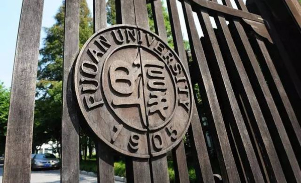
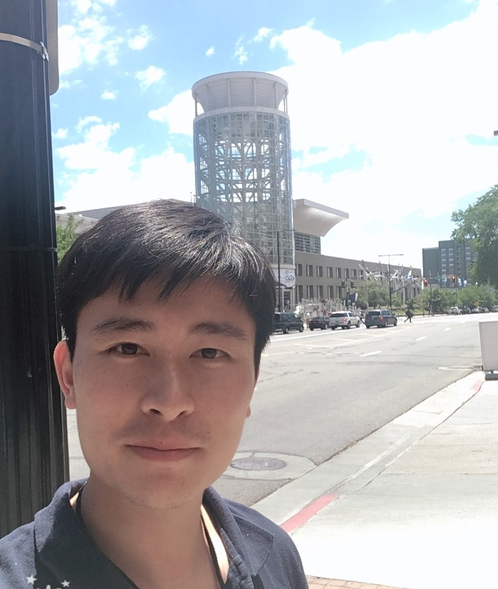

##  ⭐ Latest news (2021.07.23) 课题组1篇论文被2021 ICCV接收！
##  ⭐ Latest news (2021.07.01) 课题组3篇论文被2021 ACM MM接收！

 

 

### 谭伟敏 (Weimin Tan)
  Email: wmtan@fudan.edu.cn

博士，中共党员，博士，复旦大学 计算机科学技术学院 青年研究员，硕士研究生导师。在IEEE TIP、TCSVT、TMM、CVPR、AAAI、ACM MM、GIE等IEEETrans.等国际期刊和CCF A类会议上发表论文20多篇，获2021年度[复旦大学“优秀博士后”](https://mp.weixin.qq.com/s/xoAtlh7N3dT2Px1uLbnxyQ)。

### 主要研究方向
1. 图像处理（image enhancement, image inpainting, image denoise, image retargeting, video interpolation/super-resolution）
2. 计算机视觉（image retrievel, semantic segmentation）
3. 智慧医疗（deep learning in microscopy imaging, diagnosis, prediction）

## 招生信息

###  ⭐ 招聘智慧医疗方向的博士后，欢迎有生物医学专业背景、有志于计算机方向发展的学生。
###  ⭐ 欢迎本科生进入课题组实习，提前进入科研训练，积累科研成果。

本课题组以科学研究项目为主，重点培养学生的学术探索、算法创新、科研能力，所以实验室的学术氛围宽松、自由，尽量让学生发挥自身的创新能力。鉴于企业项目大多为科研项目的直接应用，扎实的理论基础和突出的科研能力有助于学生就业后解决企业遇到的新问题，在企业中更容易脱颖而出。此外，课题组对待学术型硕士和专业型硕士的培养方式和管理模式一致，均希望在有限的研究生培养时间（2~3年）里，尽可能的提升科研能力，为将来的职业发展打好基础。

招生对象：硕士、博士、博士后。欢迎对科研热忱、积极思考、勤奋好学的学生。

研究领域：图像处理、计算机视觉、智慧医疗。

招生要求：由于招生名额有限（特别是学术型硕士），报名人数多，因此设置了一些基础要求如下：

1. 身心健康、积极乐观。身体健康、思想积极乐观是生活与事业发展的基础。
2. 至少简单浏览本课题组近几年的论文，以便了解我们在做什么，也有助于面试表现更好。
3. 本科期间有过科研训练的优先、有过论文发表的优先、有ACM/ICPC竞赛获奖优先。
4. 对学生的期望：1) 优良的做人做事习惯，做事认真负责、刻苦努力，做人宽和谦逊、诚实守信；2) 追求优良的科研素养，做有启发的、推动领域发展的研究；3) 做有用的研究，让研究成果在国家社会生产活动中发挥作用。以上期望也是本课题组培养的目标。

### 部分发表论文
* Weimin Tan, Bo Yan, Ke Li, Qi Tian. Image Retargeting for Preserving Robust Local Feature: Application to Mobile Visual Search. IEEE Trans. Multim. 18(1): 128-137 (2016)
* Weimin Tan, Bo Yan. A survey on high coherence visual media retargeting: recent advances and applications. Frontiers Comput. Sci. 10(5): 778-796 (2016) (邀稿论文)
* Bo Yan, Weimin Tan, Ke Li, Qi Tian. Codebook Guided Feature-Preserving for Recognition-Oriented Image Retargeting. IEEE Trans. Image Process. 26(5): 2454-2465 (2017)
* Weimin Tan, Bo Yan. Salient object detection via multiple saliency weights. Multim. Tools Appl. 76(23): 25091-25107 (2017) (NCMT'2016 Best paper)
* Weimin Tan, Bo Yan, Bahetiyaer Bare. Feature Super-Resolution: Make Machine See More Clearly. CVPR 2018: 3994-4002
* Weimin Tan, Bo Yan, Chuming Lin. Beyond Visual Retargeting: A Feature Retargeting Approach for Visual Recognition and Its Applications. IEEE Trans. Circuits Syst. Video Technol. 28(11): 3154-3162 (2018)
* Bo Yan, Chuming Lin, Weimin Tan. Frame and Feature-Context Video Super-Resolution. AAAI 2019, 5597-5604
* W Tan, B Yan, C Lin, X Niu. Cycle-IR: Deep cyclic image retargeting. IEEE Transactions on Multimedia 22 (7), 1730-1743
* Bo Yan, Bahetiyaer Bare, Chenxi Ma, Ke Li, Weimin Tan. Deep Objective Quality Assessment Driven Single Image Super-Resolution. IEEE Trans. Multim. 21(11): 2957-2971 (2019)
* Bo Yan, Bahetiyaer Bare, Weimin Tan. Naturalness-Aware Deep No-Reference Image Quality Assessment. IEEE Trans. Multim. 21(10): 2603-2615 (2019)
* Bo Yan, Weimin Tan, Chuming Lin, Liquan Shen. Fine-Grained Motion Estimation for Video Frame Interpolation. IEEE Trans. Broadcast. 67(1): 174-184 (2021)
* Bo Yan, Chenxi Ma, Bahetiyaer Bare, Weimin Tan, Steven C. H. Hoi. Disparity-Aware Domain Adaptation in Stereo Image Restoration. CVPR 2020: 13176-13184
* Bo Yan, Qing Lin, Weimin Tan, Shili Zhou. Assessing Eye Aesthetics for Automatic Multi-Reference Eye In-Painting. CVPR 2020: 13506-13514
* Qing Lin, Bo Yan, Jichun Li, Weimin Tan. MMFL: Multimodal Fusion Learning for Text-Guided Image Inpainting. ACM Multimedia 2020: 1094-1102

